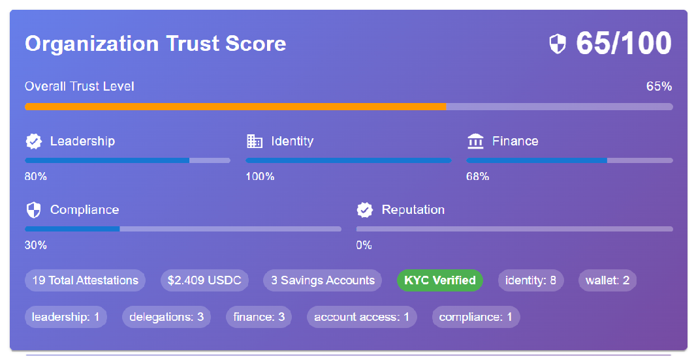

# 🏢 MyOrgWallet Web Application

<div align="center">


**🚀 The Future of Organizational Digital Wallets and building Trust**  
*Empowering seamless and secure Web3 interactions for organizations*

[](https://youtu.be/2WAkvM0JogA)

</div>

---

<div align="center" style="display: flex; justify-content: center; gap: 20px; align-items: flex-start;">
  <div style="text-align: center;">
    
    <br><br>
    You know what makes your organization valuable.
    <br><br>
  </div>
  <div>
    
    <br>
    MyOrgWallet helps organizations prove they’re trustworthy.
    <br><br>
  </div>
</div>

---

## 📋 Overview

**MyOrgWallet** is a cutting-edge Web3 digital wallet designed for organizations, empowering seamless and secure interactions in decentralized ecosystems. Built with modern blockchain technology and AI-driven management, it provides comprehensive organizational wallet solutions with advanced security and compliance features.

### ✨ Key Features

- 🤖 **Smart Agentic AI Driven Management** - OpenAI and LangChain powered assistant
- 🏦 **Organization Chart-of-Accounts (CoA)** - Complete financial management
- 🔐 **Advanced Security** - Account Abstraction (ERC-4337) with delegation controls
- 📜 **Verifiable Credentials** - W3C compliant digital identity management
- 🌐 **Cross-Chain Support** - Multi-chain operations with CCTP v2 and LiFi
- 🎯 **KYB Compliance** - Know-Your-Business verification framework leveraging MetaMask Card verification

---

## 🎯 Core Capabilities

### Organization Trust Score

| Feature | Description | Networks |
|---------|-------------|----------|
| [Public Organization Explorer](https://odysee.com/OrganizationsView:2) | Organization Trust Score | Optimism Mainnet |

### 🏦 Organization Chart-of-Accounts (CoA)

All accounts managed with CoA have associated Account Abstraction (AA), VC's, Attestations and zkp's
All access control of accounts is managed via MetaMask Delegations between individuals AA and CoA Account AA

| Feature | Description | Networks |
|---------|-------------|----------|
| [Verify MetaMask Card EOA](https://odysee.com/MetaMaskCardVerifier2) | Verification and analysis of Card withdrawals via contract 0xA90b...dD2 | Linea Mainnet |
| [Fund MetaMask Card with USDC (LiFi)](https://odysee.com/fundtransferusingLiFiMainnetv2:2) | USDC transfer from Savings Account -- LiFi | Optimism & Linea Mainnet
| [Fund MetaMask Card with USDC (CCTP v2)](https://odysee.com/fundtransferusingLiFiMainnetv2:2) | USDC transfer from Savings Account - CCTP v2 | Sepolia & Linea Testnet |
| [Fund MetaMask Card with ERC-20 transfer](https://odysee.com/FundCardIntraChain:5) | USDC transfer from Savings Account - ERC-20 transfer | Optimism Mainnet |
| [Add Savings Account](https://odysee.com/AddSavingsAccountMainnet2:0) | Add a new USDC Savings Account to org wallet  | Mainnet & Testnet |
| [Manage Account Access Control](https://odysee.com/AddAccessControlMainnet:0) | Add user permission to manage USDC Savings Account | Mainnet & Testnet |
| [Add MetaMask Card to CoA](https://odysee.com/addMetaMaskCardMainnet:f) | Add user MetaMask Card to the org Wallet. Verify Card and add it to org wallet CoA | Mainnet & Testnet |


### 🤝 MCP Client Agent Integration (external agent post USDC to myOrgWallet Operating Accounts)

| Feature | Description | Networks |
|---------|-------------|----------|
| [MCP Agent-to-Agent (Intra-chain, Eth)](https://odysee.com/MCPAgentTransferEth:0) | Identity/Trust exchange, Agreement and Payment via ETH native coin | Mainnet & Testnet |
| [MCP Agent-to-Agent (Cross-chain, USDC CCTP v2)](https://odysee.com/MCPAgentTransfer:6) | Cross-Chain Identity/Trust exechange, Agreement and Payment via USDC CCTP v2 | Sepolia & Base Testnet |
| [ERC-7715 Permission Delegation Transfer](https://odysee.com/DelegatedPermissions:0) | Inner-chain transfer | Sepolia Testnet |


### MetaMask Snap Verifiable Credential Management (view your myOrgWallet VC's using masca.io)

| Feature | Description | Networks |
|---------|-------------|----------|
| [myOrgWallet VC's viewable via masca.io](https://odysee.com/MascaVC:6) | All myOrgWallet VC's are stored in MetaMask wallet snap using veramo | Optimism Mainnet |


### Attestatation Management (view your myOrgWallet Attestations using https://optimism.easscan.org/)
Once linea mainnet support DKT myOrgWallet will run under linea mainnet and Verax will be used for attestation management.  myOrgWallet uses Ethereum Attestations services to store all wallet stateful "structure" information except for Verifiable Credentials.   

| Feature | Description | Networks |
|---------|-------------|----------|
| [myOrgWallet attestation schemas](https://odysee.com/EASSchema:e) | Each category of attestation has its own schema defintion within AES | Optimism Mainnet |


---

## 🏛️ Pillars of Organizational Trust (Know-Your-Business, KYB)

### 👑 Verified Leadership
- **Individual Leader KYC** - MetaMask Card USDC transfer verification
- **Proof of Authority** - Public attestations with delegation credentials

### 🏢 Verified Organization Identity
- **Legal Registration** - Secretary-of-State records with attestations
- **Web Presence** - Verified DNS + ENS (did:web, did:ens)
- **Social Proofs** - LinkedIn, X, Shopify OAuth verification

### 💰 Verified Finance
- **CoA Organization Finances** - Proof of funds with attestations
- **Delegated Spending** - Smart accounts with delegation controls

### 📋 Verified Compliance
- **Certificate of Insurance** - Insurer-issued verifiable attestations
- **Regulatory Licenses** - On-chain compliance verification

### 🌟 Reputation & Ecosystem Trust
- **Third-party Endorsements** - Community-driven trust signals
- **Customer Reviews** - Outcome-based reputation system

---

## Technical Capabilities

### Account Abstraction (AA):

Utilize ERC-4337 to enable smart contract wallets, supporting gasless transactions and flexible user experiences without traditional private key management. Simplify onboarding with paymasters and bundled transactions.

### Delegation:

Implement delegated authority, allowing myOrgWallet users to define and publish verifiable credentials, attestations, zero-knowledge proof on the blockchain under a single delegated metamask signed delegation.

### Verifiable Credentials (VCs):

Issue and verify fraud-proof digital credentials (e.g., certifications, memberships) using W3C standards, stored securely in user MetaMask wallets. Enable selective disclosure for privacy-preserving identity verification.

### Published Attestations:

MyOrgWallet empowers business to publish business attestations, associated with their verifiable credentials. Attestations are discoverable on-chain and linked to verifiable zero-knowledge-proofs.

### Zero-Knowledge Proofs (ZKPs):

Integrate ZKPs to prove attributes (e.g., website ownership, compliance) without revealing sensitive data, enhancing privacy in eCommerce and trust frameworks.

### AI Chatbot:

Develop an AI-powered chatbot within MyOrgWallet to assist users, answer queries, and guide credential management, leveraging natural language processing for intuitive interactions.

### Agentic AI Web Scraping:

Build autonomous AI agents that traverse the web data (e.g., verify state registration or domain ownership) to inform decision-making, integrating with MyOrgWallet for secure data handling and credential issuance.

### Credential Issuer:

Create tools for organizations to issue VCs (e.g., employee badges, supplier certifications) via MyOrgWallet, using blockchain for immutability and cryptographic signatures for trust.

### Challenge:

Design a solution showcasing these features, such as a decentralized eCommerce platform where MyOrgWallet verifies supplier credentials, delegates transaction authority to AI agents, and uses ZKPs for privacy. Compete for prizes by demonstrating scalability, user experience, and Web3 innovation!

## Explanation, Functions, and Features

### Organization Smart Wallet (AA) and Individuals Smart Wallet (AA) linked to EOA account (no funds required)

- Connect to an individual'ss EOA that has no funds (newly create MetaMask account within MetaMask wallet).
- Generate and deploy individual smart wallet (AA) that is driven from (owned by) an individuals EOA.
- Generate and deploy organization smart wallet (AA) that is associated with the first individual's smart wallet (AA).

### Organization (AA) to Individual (AA) Delegation -  give Individuals (AA) rights to create attestations for Organization

- Create a delegation "from" the organization smart wallet (AA) "to" the individual's smart wallet (AA).
- Save that this indiv-to-org delegation for future use. Stored in indiv-to-org on-chain attestation.
- Create chained delegation from indiv-to-org delegation to burner Account. Store delegation in browser local storage for subsequent onchain smart wallet user operations.

### Org-to-Indiv Delegation chained to Burner Delegation - support multiple user-operations to creating Organization and Individual Attestations

- Create a burner Account.
- Create a stored chained delegation from Ind-Org delegation to burner account in support of organization level smart wallet user operations.
- Create a stored delegation from individual smart wallet (AA) to support individual level smart wallet user operations.

### Issue Verifiable Credentials (VC) associated with Individuals (AA) and Organization (AA), DID references

- Create a set of verifiable credentials for the individual smart wallet (AA). Similar to humanity protocol use-case.
- Create a set of verifiable credentials for the organization smart wallet (AA). Unique to org wallet company goals.
- Credential sets created with the use of an agentic AI model (OpenAI) which scraped publically available company information through the web.
- Company information includes name, id number, form, status, formation date, state, and address.
- Agentic AI model is given direction through the use of an app-embedded chatbot.

### Publish VC related Attestations (on-chain Organization and Individual) and associated Zero Knowledge Proofs

- Generate a ZKP for each verifiable credential (associated with smart wallets) and attach to attestation.
- Create attestations using entry point user op to EAS contract. Using Paymaster, Bundler and delegationChain RedeemDelegation.

### Link second Individuals (AA) to Organization (AA)

- Second individual domain name link to published organization (AA) attestation domain name.
- Second individual creates individual (AA) only with domain name attestation.
- First individual is prompted with new associated individual (AA) accounts and they create a delegation from org AA to second individual AA.
- Second individual now has rights to add attestations to organization AA. This is done via burner chained delegation when they connect in.

### All published Individual and Organization attestations and zero-knowledge proofs are on-chain

- 3rd party can search and explore an organizations attestations and leadership information.

### Multi-User Operations via Bundler and Paymaster

- Bundle/batch multiple EAS contract users operations in single bundled request.

### Individuals fully control their account and attestations. Individuals jointly manage Organizations Attestations


## Goals

* Provide an organization a digital wallet (Account Abstraction) to manage their organizational and individual attestations.
* Use a modern web3 stack and leverage latest MetaMask capabilities.
* Intuitive AI chat driven UI. No MetaMask permission popups within main application (one time permission popups during initial onboarding).
* Role based (via delegation) security. On-chain based on domain and leveraged by all dApps.

## Architecture


## Technology

* React
* Wagmi
* Viem
* Ethers
* Metamask/Delegation-Toolkit
* Hyrbid Signatory/Factory
* Pimlico (bundler, paymaster)
* Apollo
* EAS
* Openai
* Python
* Django
* Selenium
* Lavague
* Veramo (future)
* Masca Snap (future)

## Prompts

* approve leader (first person creating organization is automatically given this capability)
    - delegation from org to individual (provide individuals with rights to post attestations on org)
    - create org leader verifiable credential which represents individuals role
    - post org leadership attestation which represents individuals role


* add account (category: 1110 - Savings)
    - create smart account and set CoA category
    - delegation from savings account to org (org has permission to move money)
    - create VC and attestation for savings account
    - create VC and attestation for from savings account to org delegation 

* approve account access
    - chain delegation from org to individual for access to savings account (extend access to savings account)
    - create VC and attestation for individual access to savings account

* add debit card (debit card on any chain)
    - capture debit card chain id and wallet address
    - create individual debit card VC, attestation and associated with CoA

* fund card
    - send USDC from selected Savings account to selected debit Card EOA


if (lastUserResponse.toLowerCase().includes("add account")) {
        console.info("add account ...")
        setAddSavingsModalVisible(true)
      }
      if (lastUserResponse.toLowerCase().includes("approve account access")) {
        console.info("approve account access ...")
        setApproveAccountAccessModalVisible(true)
      }
      if (lastUserResponse.toLowerCase().includes("add debit card")) {
        console.info("add debit card ...")
        setAddAccountModalVisible(true)
      }
      if (lastUserResponse.toLowerCase().includes("fund card")) {
        console.info("fund card ...")
        setFundCreditCardModalVisible(true)
      }


## Requirements

* [NodeJS](https://nodejs.dev/en/)
* [npm](https://www.npmjs.com/)
* [OpenAI API Account](https://openai.com/blog/openai-api)
* [metamask delegation toolkit]


## Setup

### 1. Create Environment Variable File (If Absent)

```sh
cd MyOrgWallet

touch .env
```

### 2. Install Dependencies

When installing dependencies, make sure the node version is up-to-date. Check the current node version with `node -v`. Update note with `nvm install node`.

```sh
npm install
```

### 3. Run Client

```sh
open http://localhost:5173

npm run dev
```

### 4. Run Server

```sh
open http://localhost:8080

npm run start
```

## DID's used by application

```
RichCanvas Organization
RichCanvas EAO Owner DID:
    did:pkh:eip155:10:0x9cfc7e44757529769a28747f86425c682fe64653
RichCanvas Org (Abstract Account, Smart Wallet) DID:
    did:pkh:eip155:10:...
```

## Contributions

This project is based on elebitzero, openai-react-chat, licensed under the MIT License. Substantial changes have been made. See elebitzero openai-react-chat MIT License.txt for the original license.

